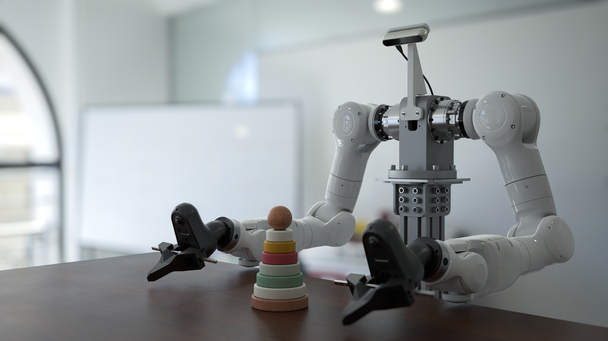

# Genesis World



[](https://github.com/Genesis-Embodied-AI/genesis-world)
[](https://pypi.org/project/genesis-world/)
[](https://genesis-embodied-ai.github.io/)
[](https://discord.gg/nukCuhB47p)

**Genesis World** is a simulation platform for physical AI development. It combines a unified multi-physics engine, a photorealistic renderer ([Nyx](https://github.com/Genesis-Embodied-AI/genesis-nyx)), and a cross-platform compiler ([Quadrants](https://github.com/Genesis-Embodied-AI/quadrants)) behind a single Pythonic API. It scales from a laptop CPU to datacenter GPUs, and it is written in Python so you can read, extend, and embed it directly in research code.

Genesis World began as an academic project in December 2024, under the name **Genesis**, and is now developed with support from [Genesis AI](https://www.genesis.ai/). For a tour of how the system fits together, see {doc}`/user_guide/overview/what_is_genesis`; for the design rationale, see the [blog post](https://www.genesis.ai/blog/the-role-of-simulation-in-scalable-robotics-genesis-world-10-and-the-path-forward).

## Key features

- **Pythonic and open source.** The engine is written and exposed in Python, so reading the code and contributing to it are straightforward.
- **Simple to install and use.** A single `pip install`, and an API designed to stay small and predictable as scenes grow.
- **Fast parallel simulation.** Thousands of environments run in parallel on a single GPU — up to 10–80× faster than prior GPU-accelerated simulators such as Isaac Gym/Sim/Lab and MuJoCo MJX, without compromising accuracy. See the [blog post](https://www.genesis.ai/blog/the-role-of-simulation-in-scalable-robotics-genesis-world-10-and-the-path-forward) for methodology.
- **Unified multi-physics.** Rigid, FEM, MPM, and particle (PBD/SPH) solvers share one scene and one state, with explicit coupling between them.
- **Photorealistic rendering.** [Nyx](https://github.com/Genesis-Embodied-AI/genesis-nyx), an in-house renderer built for robotics, plugs in as a camera sensor alongside Luisa and Pyrender.
- **Differentiable.** Autodiff and backpropagation are provided through the [Quadrants](https://github.com/Genesis-Embodied-AI/quadrants) compiler.
- **Comprehensive sensors.** Tactile, IMU, lidar, depth-camera, contact-force, surface-distance, and temperature-grid sensors work out of the box in parallel and heterogeneous environments.

For a closer look at each layer, see {doc}`/user_guide/overview/what_is_genesis` and {doc}`/user_guide/overview/why_a_new_simulator`.

## Getting started

Install PyTorch by following the [official instructions](https://pytorch.org/get-started/locally/), then install Genesis World from PyPI:

```bash
pip install genesis-world
```

From there, the {doc}`user guide </user_guide/index>` covers installation in detail, tutorials, and the full API reference.

## Contributing

Genesis World aims to be a transparent, community-driven ecosystem where roboticists and graphics researchers build a fast, physically and visually realistic virtual world together. Contributions of every size are welcome — pull requests for new features, bug reports, and suggestions that make the API more intuitive. See {doc}`our mission </user_guide/overview/mission>` for the longer story.

## Support

- Report bugs and request features through GitHub [Issues](https://github.com/Genesis-Embodied-AI/genesis-world/issues).
- Ask questions and share ideas in GitHub [Discussions](https://github.com/Genesis-Embodied-AI/genesis-world/discussions).

## Citation

If Genesis World supports your research, please cite it. A technical report is in progress; until it is published, you can cite:

```bibtex
@misc{Genesis,
  author = {Genesis Authors},
  title  = {Genesis: A Generative and Universal Physics Engine for Robotics and Beyond},
  month  = {December},
  year   = {2024},
  url    = {https://github.com/Genesis-Embodied-AI/genesis-world}
}
```

```{toctree}
:maxdepth: 1

user_guide/index
api_reference/index
```
