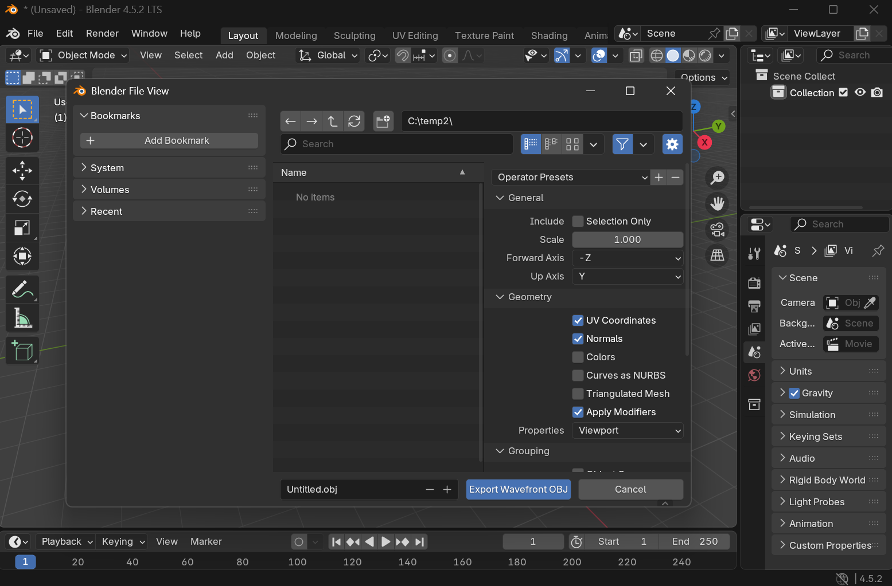

# 📐 约定

本页概述了 Genesis 中使用的坐标系和数学约定。

## 坐标系

Genesis 使用右手坐标系，遵循以下约定：

- **+X 轴**：指向屏幕外（朝向观察者）
- **+Y 轴**：指向左侧
- **+Z 轴**：指向上方（垂直方向）

## 四元数表示

Genesis 中的四元数遵循 **(w, x, y, z)** 约定，其中：
- **w**：标量分量（实部）
- **x, y, z**：向量分量（虚部）

这也被称为"标量优先"或"Hamilton"约定。使用四元数指定旋转时，始终按此顺序提供。

### 示例
```python
# 表示绕 Z 轴旋转 90 度的四元数
rotation = [0.707, 0, 0, 0.707]  # [w, x, y, z]
```

## 重力

重力向量定义为：
- **重力方向**：**-Z**（指向下方）
- **默认大小**：9.81 m/s²

这意味着当没有其他力作用时，物体将自然向 Z 轴负方向下落。

## 导入时的轴转换

不同的 3D 资产格式定义（或省略）坐标系约定。Genesis 允许你精确定义规则，以确保与其 Z 轴向上内部表示的一致性。以下部分描述了每种支持的格式的处理方式。

### 与 Blender 导出器对齐

Genesis 的资产导入行为明确与 Blender 的默认导出器设置对齐。Blender 是机器人和仿真资产的常用创作工具，其导出器根据目标格式应用定义明确的轴转换（例如，从 Blender 内部 Z 轴向上空间导出到 glTF 的 Y 轴向上约定）。

通过镜像 Blender 的导出器行为：
- 使用默认设置从 Blender 导出的资产导入 Genesis 时具有**预期的方向**。
- **用户可以依赖 Blender 的预览**和变换，**无需**引入格式特定的解决方法。
- **跨格式一致性**（glTF、STL、OBJ、URDF 引用的网格）得以保持。

### Y 轴向上 ↔ Z 轴向上不是单一约定

**不存在单一的通用转换**可以在 Y 轴向上和 Z 轴向上坐标系之间进行转换。一般来说，Y 轴向上和 Z 轴向上之间的转换由 3×3 旋转矩阵定义，根据剩余轴（通常是前进和右方向）的映射方式，存在多个有效的矩阵。两个资产都可以标记为"Y 轴向上"，但如果它们选择了不同的前进轴，方向可能会有所不同。

因此，仅仅说明资产是"Y 轴向上"或"Z 轴向上"不足以完全定义其空间约定。前进轴的选择决定了旋转矩阵的定义方式。

#### Genesis 约定

Genesis 采用与 Blender 导出器行为一致的特定且一致的 Y 轴向上 ↔ Z 轴向上映射。更准确地说：

Blender 的内部坐标系是 Z 轴向上。当导出到 Y 轴向上格式时，Blender 允许你指定任何可能的上向量和前向量组合。Genesis 采用 Blender 的默认 Y 轴向上导出器配置：**Y 轴向上，−Z 轴向前**。这确保了：
- 使用默认轴设置从 Blender 导出的资产在 Genesis 中看起来完全相同
- 所选的 3×3 旋转矩阵在各个格式之间保持一致
- 轴转换行为可预测且可复现
- Genesis 中对"Y 轴向上"处理的所有引用都指这种与 Blender 对齐的 Y 轴向上表示，而不是抽象或模糊的 Y 轴向上定义。

### glTF (.gltf / .glb)
在 Genesis 中，[glTF 资产始终被解释为 Y 轴向上](https://registry.khronos.org/glTF/specs/2.0/glTF-2.0.html#coordinate-system-and-units)。导入期间，Genesis 会自动将 glTF 网格从 Y 轴向上转换为 Z 轴向上。此行为是固定的，无法覆盖，以确保符合 glTF 规范。导入后，生成的网格保证位于 Genesis Z 轴向上空间中。

Blender 允许通过取消选中 **+Y-up** 选项将 glTF 导出为 Z 轴向上。但是，Blender 无法提供正确重新导入该资产的选项。**Genesis 不支持导入导出为 Z 轴向 glTF**。


Blender GLTF 导出器：
https://docs.blender.org/manual/en/2.83/addons/import_export/scene_gltf2.html#transform

### STL (.stl) 和 Wavefront OBJ (.obj)

STL 和 Wavefront OBJ 格式没有定义标准坐标系。因此，必须在导入时显式指定正确的上轴。因此，以这些格式创作的资产可能是 Y 轴向上或 Z 轴向上，具体取决于原始工具或流程。对于 STL 和 OBJ 文件，Genesis 允许用户显式指定应如何解释资产：

#### Z 轴向上（默认）

假定网格已处于 Z 轴向上空间。导入时不执行轴转换。

#### Y 轴向上

假定网格是以 Y 轴向上空间创作的，并应用上述 Y 轴向上 → Z 轴向上转换。这种灵活性允许来自不同来源的 STL 和 OBJ 资产在无需修改原始文件的情况下正确导入。



Blender 的 Wavefront 导出器：
https://docs.blender.org/manual/en/4.0/files/import_export/obj.html#object-properties
Blender 的 STL 导出器：
https://docs.blender.org/manual/fr/3.6/addons/import_export/mesh_stl.html#transform

### 在 Genesis 中正确导入资产
为了给 Genesis 提供提示，FileMorph 类中提供了 **file_meshes_are_zup** 导入选项

```python
obj_y = scene.add_entity(
    morph=gs.morphs.Mesh(
        file="my_obj_file.obj",
        # 我们向 Genesis 提示此文件引用的网格
        # 不在 Z 轴向上空间中，因此需要在导入时进行转换。
        # True = 网格已经是 Z 轴向上；False = 网格是 Y 轴向上并需要转换。
        file_meshes_are_zup=False,
    ),
)
```

导入后，morph 将具有 **imported_as_zup** 标志，允许了解是否对网格进行了修正：
```python
obj_y.vgeoms[0].mesh.metadata["imported_as_zup"]
```
