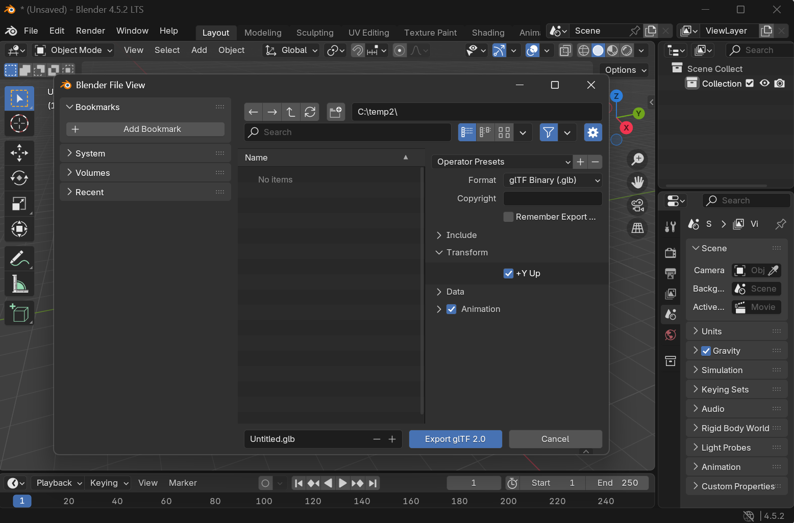
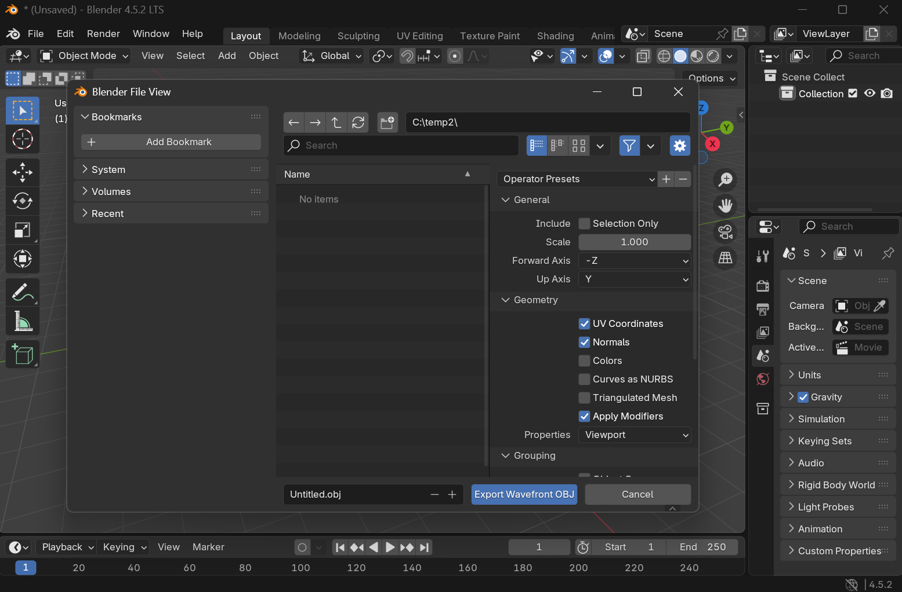

# 📐 規約

このページでは、Genesis 全体で使用される座標系と数理的な規約を説明します。

## 座標系

Genesis は右手系を採用し、以下の規約に従います。

- **+X 軸**: 画面の手前方向（閲覧者側）
- **+Y 軸**: 左方向
- **+Z 軸**: 上方向（鉛直）

## クォータニオン表現

Genesis のクォータニオンは **(w, x, y, z)** 規約です。
- **w**: スカラー成分（実部）
- **x, y, z**: ベクトル成分（虚部）

これは "scalar-first" または "Hamilton" 規約とも呼ばれます。
クォータニオンで回転を指定する際は、常にこの順序で与えてください。

### 例
```python
# Z軸周りに90度回転するクォータニオン
rotation = [0.707, 0, 0, 0.707]  # [w, x, y, z]
```

## 重力

重力ベクトルは次のように定義されます。
- **重力方向**: **-Z**（下向き）
- **デフォルトの大きさ**: 9.81 m/s²

つまり、他の力が作用しない場合、物体は自然に負の Z 方向へ落下します。

## インポート時の軸変換

3D アセット形式ごとに座標系規約は異なり、規約が明示されない形式もあります。
Genesis では、内部の Z-up 表現と整合させるためのルールを明確に定義できます。
以下では、サポート形式ごとの扱いを説明します。

### Blender エクスポータとの整合

Genesis のアセットインポート挙動は、Blender のデフォルトエクスポータ設定に明示的に合わせています。
Blender はロボティクス/シミュレーションでよく使われる制作ツールで、エクスポータは出力形式に応じた軸変換を実行します
（例: Blender の内部 Z-up 空間から glTF の Y-up 規約への変換）。

Blender の挙動に合わせることで、次が保証されます。
- Blender のデフォルト設定で出力したアセットは、Genesis に期待どおりの向きで取り込まれる
- ユーザーは形式ごとの回避策なしに、Blender のプレビューと変換結果をそのまま信頼できる
- 形式間の一貫性（glTF、STL、OBJ、URDF 参照メッシュ）が維持される

### Y-up ↔ Z-up は単一規約ではない

Y-up と Z-up の間を変換する **唯一の普遍変換** は存在しません。
一般にこの変換は 3×3 回転行列で定義され、残り軸（通常は前方軸と右軸）の対応のさせ方によって複数の有効行列が存在します。
同じ "Y-up" とされる2つのアセットでも、前方軸の定義が違えば向きは異なります。

そのため、アセットが "Y-up" または "Z-up" であるという情報だけでは、空間規約を完全には定義できません。
回転行列の定義には前方軸の選択が必須です。

#### Genesis の規約

Genesis は、Blender のエクスポータ挙動に合わせた一貫した Y-up ↔ Z-up 対応を採用します。具体的には次のとおりです。

Blender の内部座標系は Z-up です。Y-up 形式へエクスポートする際、Blender では Up/Forward ベクトルの組み合わせを任意指定できます。
Genesis では Blender のデフォルト Y-up エクスポート設定、すなわち **Y-up, −Z forward** を採用します。
これにより、次が保証されます。
- Blender のデフォルト軸設定で書き出したアセットが Genesis で同一の見た目になる
- 採用する 3×3 回転行列が形式間で一貫する
- 軸変換の挙動が予測可能で再現可能になる
- Genesis でいう "Y-up" 処理は、曖昧な一般定義ではなく、この Blender 整合の特定表現を指す

### glTF (.gltf / .glb)
Genesis では、[glTF アセットは常に Y-up として解釈](https://registry.khronos.org/glTF/specs/2.0/glTF-2.0.html#coordinate-system-and-units) されます。
インポート時に glTF メッシュは自動で Y-up から Z-up に変換されます。
この挙動は固定でオーバーライドできず、glTF 仕様への準拠を保証します。
インポート後のメッシュは、必ず Genesis の Z-up 空間になります。

Blender では **+Y-up** オプションを外すことで glTF を Z-up で出力できます。
ただし Blender 側ではそのアセットを正しく再インポートする手段がありません。
**Genesis は Z-up でエクスポートされた glTF のインポートをサポートしません**。



Blender の glTF エクスポータ:
https://docs.blender.org/manual/en/2.83/addons/import_export/scene_gltf2.html#transform

### STL (.stl) と Wavefront OBJ (.obj)

STL と Wavefront OBJ 形式には標準座標系の規定がありません。
そのため、インポート時に正しい上方向軸を明示的に指定する必要があります。
結果として、これらの形式のアセットは作成パイプラインに応じて Y-up の場合も Z-up の場合もあります。
Genesis では STL/OBJ に対し、アセットの解釈方法をユーザーが明示指定できます。

#### Z-up（デフォルト）

メッシュはすでに Z-up 空間にあると仮定され、インポート時の軸変換は行われません。

#### Y-up

メッシュは Y-up 空間で作成されたとみなし、前述の Y-up → Z-up 変換を適用します。
これにより、元ファイルを変更せずに異なる由来の STL/OBJ を正しく取り込めます。



Blender の Wavefront エクスポータ:
https://docs.blender.org/manual/en/4.0/files/import_export/obj.html#object-properties
Blender の STL エクスポータ:
https://docs.blender.org/manual/fr/3.6/addons/import_export/mesh_stl.html#transform

### Genesis での正しいアセットインポート
Genesis にヒントを与えるため、FileMorph クラスには **file_meshes_are_zup** インポートオプションがあります。

```python
obj_y = scene.add_entity(
    morph=gs.morphs.Mesh(
        file="my_obj_file.obj",
        # このファイルが参照するメッシュは Z-up ではないため、
        # インポート時に変換が必要であることを Genesis に伝えます。
        # True = すでに Z-up、False = Y-up のため変換が必要
        file_meshes_are_zup=False,
    ),
)
```

インポート後、morph には **imported_as_zup** フラグが設定され、
メッシュに補正が適用されたかどうかを確認できます。
```python
obj_y.vgeoms[0].mesh.metadata["imported_as_zup"]
```
